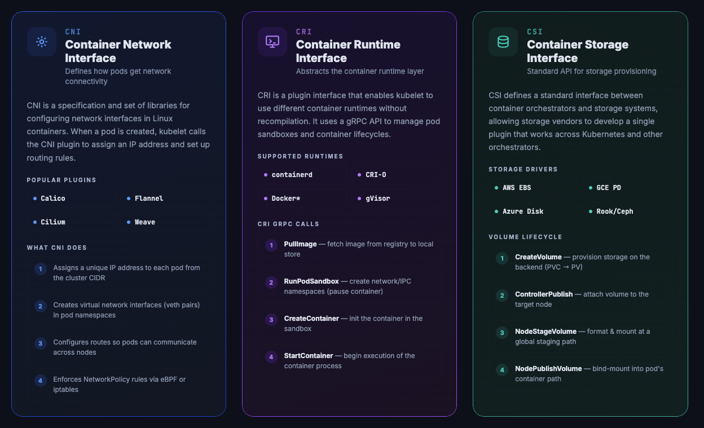

# Kubernetes Infographics



Visual reference guides for core Kubernetes concepts, served as static HTML pages from an nginx container running in a local Kubernetes cluster.

## Infographics

| File | Topic | Covers |
|------|-------|--------|
| [k8s-interfaces-cni-cri-csi.html](k8s-interfaces-cni-cri-csi.html) | **CNI · CRI · CSI** | The three plugin interfaces that make Kubernetes extensible — Container Network Interface, Container Runtime Interface, Container Storage Interface |
| [k8s-orchestration.html](k8s-orchestration.html) | **Orchestration** | Control plane components (API server, etcd, scheduler, controller-manager), worker node components, pod scheduling flow, reconciliation loop, and workload resource types |
| [k8s-networking.html](k8s-networking.html) | **Networking** | Pod networking model, Service types (ClusterIP/NodePort/LoadBalancer/Headless), Ingress, CoreDNS, NetworkPolicy, and kube-proxy modes |

## Project structure

```
.
├── Dockerfile                    # nginx:alpine image with all HTML files baked in
├── k8s-deploy.yaml               # Kubernetes Deployment + LoadBalancer Service
├── index.html                    # Landing page linking to all three infographics
├── k8s-interfaces-cni-cri-csi.html
├── k8s-orchestration.html
└── k8s-networking.html
```

## Prerequisites

- [Docker Desktop](https://www.docker.com/products/docker-desktop/) with **Kubernetes enabled**
- [`kubectl`](https://kubernetes.io/docs/tasks/tools/)
- [`kind`](https://kind.sigs.k8s.io/) CLI

> **Note:** Docker Desktop's built-in Kubernetes runs as a kind cluster (`desktop-control-plane`). The kubectl context is named `docker-desktop`.

## Deploy

### 1. Build the image

```bash
docker build -t k8s-infographics:latest .
```

### 2. Load it into the cluster

Docker Desktop Kubernetes uses kind under the hood. Images must be loaded directly into the kind node's containerd store — they are **not** automatically available from the Docker daemon.

```bash
kind load docker-image k8s-infographics:latest --name desktop
```

### 3. Apply the manifests

```bash
kubectl --context docker-desktop apply -f k8s-deploy.yaml
```

### 4. Wait for pods to be ready

```bash
kubectl --context docker-desktop rollout status deployment/k8s-infographics
```

Open **http://localhost:8080** in your browser.

## Updating the infographics

After editing any `.html` file, rebuild and re-roll the deployment:

```bash
docker build -t k8s-infographics:latest .
kind load docker-image k8s-infographics:latest --name desktop
kubectl --context docker-desktop rollout restart deployment/k8s-infographics
```

## Tear down

```bash
kubectl --context docker-desktop delete -f k8s-deploy.yaml
```

## Deploy to AWS EC2

Run the site on a single t2.micro instance using Docker (no Kubernetes required).

### Prerequisites

- [AWS CLI](https://docs.aws.amazon.com/cli/latest/userguide/install-cliv2.html) installed and configured (`aws configure`)
- An EC2 key pair created in your target region

### 1. Get the latest Amazon Linux 2 AMI

```bash
aws ec2 describe-images --region us-east-1 --owners amazon \
  --filters "Name=name,Values=amzn2-ami-hvm-*-x86_64-gp2" "Name=state,Values=available" \
  --query 'sort_by(Images, &CreationDate)[-1].ImageId' --output text
```

### 2. Create a security group

```bash
aws ec2 create-security-group --region us-east-1 \
  --group-name k8s-infographics-sg \
  --description "Security group for k8s infographics website" \
  --vpc-id <your-vpc-id>

aws ec2 authorize-security-group-ingress --region us-east-1 \
  --group-id <sg-id> --protocol tcp --port 80 --cidr 0.0.0.0/0

aws ec2 authorize-security-group-ingress --region us-east-1 \
  --group-id <sg-id> --protocol tcp --port 22 --cidr 0.0.0.0/0
```

### 3. Launch the instance

The user-data script installs Docker, clones this repo, builds the image, and starts the container automatically on boot.

```bash
aws ec2 run-instances \
  --region us-east-1 \
  --image-id <ami-id> \
  --instance-type t2.micro \
  --key-name <your-key-pair-name> \
  --security-group-ids <sg-id> \
  --subnet-id <public-subnet-id> \
  --associate-public-ip-address \
  --tag-specifications 'ResourceType=instance,Tags=[{Key=Name,Value=k8s-infographics}]' \
  --user-data '#!/bin/bash
yum update -y
yum install -y docker git
systemctl start docker
systemctl enable docker
git clone https://github.com/slg74/kubernetes_infographic_container.git /app
cd /app
docker build -t k8s-infographics:latest .
docker run -d -p 80:80 --restart unless-stopped k8s-infographics:latest'
```

### 4. Get the public IP

```bash
aws ec2 describe-instances --region us-east-1 \
  --instance-ids <instance-id> \
  --query 'Reservations[0].Instances[0].PublicIpAddress' --output text
```

Wait 2–3 minutes for the user-data script to complete, then open **http://\<public-ip\>** in your browser.

### Monitor startup

```bash
ssh -i ~/path/to/your-key.pem ec2-user@<public-ip> \
  "sudo tail -f /var/log/cloud-init-output.log"
```

### Tear down

```bash
aws ec2 terminate-instances --region us-east-1 --instance-ids <instance-id>
aws ec2 delete-security-group --region us-east-1 --group-id <sg-id>
```

---

## Why `imagePullPolicy: Never`?

The manifest sets `imagePullPolicy: Never` because the image is loaded directly into the kind node rather than pushed to a registry. If you push the image to a registry (Docker Hub, GHCR, etc.) and update the `image:` field accordingly, change this to `IfNotPresent`.

The service type is `LoadBalancer` for compatibility with real clusters (e.g. EC2). Locally with kind, `run.sh` uses `port-forward` with an auto-restart loop to keep the connection stable.
